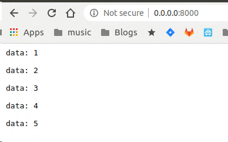

# Server Sent Events for [Starlette](https://github.com/encode/starlette) and [FastAPI](https://fastapi.tiangolo.com/)

[![PyPI Version][pypi-image]][pypi-url]
[![Build Status][build-image]][build-url]
[![Code Coverage][coverage-image]][coverage-url]

Background: https://sysid.github.io/sse/

Installation:

```shell
pip install sse-starlette
```

Usage:

```python
import asyncio
import uvicorn
from starlette.applications import Starlette
from starlette.routing import Route
from sse_starlette.sse import EventSourceResponse

async def numbers(minimum, maximum):
    for i in range(minimum, maximum + 1):
        await asyncio.sleep(0.9)
        yield dict(data=i)

async def sse(request):
    generator = numbers(1, 5)
    return EventSourceResponse(generator)

routes = [
    Route("/", endpoint=sse)
]

app = Starlette(debug=True, routes=routes)

if __name__ == "__main__":
    uvicorn.run(app, host="0.0.0.0", port=8000, log_level='info')
```

Output:  


**Caveat:** SSE streaming does not work in combination with [GZipMiddleware](https://github.com/encode/starlette/issues/20#issuecomment-704106436).

Be aware that for proper server shutdown your application must stop all
running tasks (generators). Otherwise you might experience the following warnings
at shutdown: `Waiting for background tasks to complete. (CTRL+C to force quit)`.

Client disconnects need to be handled in your Request handler (see example.py):
```python
async def endless(req: Request):
    async def event_publisher():
        i = 0
        try:
          while True:
              disconnected = await req.is_disconnected()
              if disconnected:
                  _log.info(f"Disconnecting client {req.client}")
                  break
              i += 1
              yield dict(data=i)
              await asyncio.sleep(0.2)
          _log.info(f"Disconnected from client {req.client}")
        except asyncio.CancelledError as e:
          _log.info(f"Disconnected from client (via refresh/close) {req.client}")
          # Do any other cleanup, if any
          raise e
    return EventSourceResponse(event_publisher())
```

Run the tests:
```python
make test
```

## Changelog

### 0.7.1 (2021-04-18)
- refactoring: Github Actions introduced into build pipeline

### 0.6.2 (2020-12-19)
- fix: correct shutdown signal handling in case of an endpoint which only yields sporadic messages

### 0.6.1 (2020-10-24)
- updated example with proper error handling

### 0.6.0 (2020-10-24)
- In case [uvicorn](https://www.uvicorn.org/) is used: monkeypatch uvicorn signal-handler, 
  in order to gracefully shutdown long-running handlers/generators.


<!-- Badges -->

[pypi-image]: https://img.shields.io/pypi/v/sse-starlette
[pypi-url]: https://pypi.org/project/sse-starlette/
[build-image]: https://github.com/sysid/sse-starlette/actions/workflows/build.yml/badge.svg
[build-url]: https://github.com/sysid/sse-starlette/actions/workflows/build.yml
[coverage-image]: https://codecov.io/gh/sysid/sse-starlette/branch/main/graph/badge.svg
[coverage-url]: https://codecov.io/gh/sysid/sse-starlette